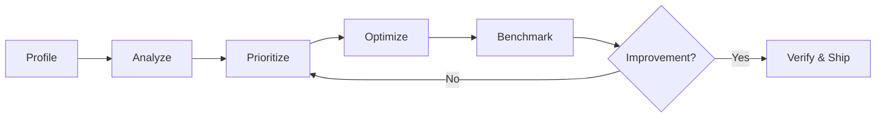

# Performance Optimization Skill

## When to Use

- User provides profiling data (pprof, flamegraph, py-spy, Chrome DevTools, Dart DevTools)
- User asks to analyze or optimize performance of a specific component
- A benchmark regression is detected
- After deploying a new feature that touches a hot path

## Core Methodology



### Step 1: Profile

Collect profiling data using the language-appropriate tool. Load the relevant `languages/*.md` module for exact commands.

**Output:** Raw profiling data (CPU profile, heap profile, or trace).

### Step 2: Analyze

Read the profile. Focus on these principles (universal across all runtimes):

1. **Focus on `cum` (cumulative):** The total resources consumed by a function AND everything it called. This finds the expensive architectural flows.
2. **Contextualize `flat`:** Resources consumed by the function itself only. If a runtime function (GC, malloc, syscall) has high flat time, trace it UP the call chain to find the user-land code that triggered it.
3. **Ignore runtime noise:** Scheduler overhead (`runtime.mcall`, `runtime.systemstack`, GC workers) will always appear. Note if GC pressure is high, but don't try to "fix" the scheduler.
4. **Separate benchmark artifacts from production cost:** Test harness allocations (e.g., `httptest.NewRequest`, `ResponseRecorder`) inflate heap profiles but don't exist in production.

**Output:** Structured analysis document in `docs/research_logs/{component}-perf-analysis.md`.

### Step 3: Prioritize

Rank fixes by **impact/risk ratio**:

| Priority | Criteria |
|---|---|
| Do first | Low risk, high impact (caching, pre-allocation, fast-reject) |
| Do second | Medium risk, high impact (library swap, algorithm change) |
| Do last | High risk, high impact (major refactor, custom implementation) |
| Skip | Any risk, low impact (micro-optimization below noise floor) |

**Rule:** If a fix requires more than 1 day AND saves < 20% on the hot path, defer it.

### Step 4: Optimize

Implement one fix at a time. For each fix:
1. Write tests FIRST (TDD — Red → Green → Refactor)
2. Implement the fix
3. Run all existing tests to verify no regression
4. Benchmark immediately

**Never batch multiple optimizations into one commit.** Each fix must be independently verifiable and revertable.

### Step 5: Benchmark

Compare before/after with the **exact same benchmark configuration** (same `-benchtime`, same `-count`, same machine load). Report:
- `ns/op` (latency)
- `B/op` (memory per operation)
- `allocs/op` (heap allocations per operation)

### Step 6: When to Stop

**Stop optimizing when any of these are true:**
- Remaining CPU is in hardware-optimized assembly (AES-NI, P-256, SIMD) — you cannot beat the hardware
- Remaining allocations are from the language runtime itself (GC, goroutine stacks, HTTP server internals)
- The fix requires a custom implementation of a well-audited library — the security/maintenance risk outweighs the perf gain
- The measured improvement is < 5% and within benchmark noise

---

## Optimization Pattern Catalog

These are generic, language-agnostic patterns. Apply them when the profiling data shows the corresponding symptom.

### Pattern: Result Caching

**Symptom:** Same expensive computation repeated with identical inputs (crypto verification, JSON parsing, regex compilation).

**Fix:** Cache results keyed by input hash. Use bounded LRU with TTL to prevent memory exhaustion.

**Safety invariant:** When caching security-sensitive results (auth tokens, permission checks):
- ALWAYS re-validate expiry/revocation on cache hit
- ALWAYS bound cache size (DoS protection)
- ALWAYS set TTL shorter than the security credential's validity period

### Pattern: Pre-allocation

**Symptom:** High `allocs/op` from repeatedly constructing the same objects (option structs, config slices, header maps).

**Fix:** Build the object once at init time, share it read-only across requests. Safe for concurrent use if the object is immutable after construction.

### Pattern: Fast-Reject / Short-Circuit

**Symptom:** Expensive validation path runs even for clearly invalid inputs.

**Fix:** Add a cheap structural pre-check before the expensive path. Examples: check string length before regex, count delimiters before parsing, check content-type before deserialization.

### Pattern: Library Swap

**Symptom:** High allocation count or CPU in a third-party library's internal parsing/serialization.

**Fix:** Replace with a library that uses lower-allocation strategies (manual scanners vs `encoding/json.Decoder`, zero-copy parsing, arena allocation).

**Safety invariant:** When swapping security-critical libraries (JWT, TLS, crypto):
- Explicitly restrict accepted algorithms (prevent algorithm confusion attacks)
- Verify the replacement library is well-audited and actively maintained
- Run the full existing test suite — no behavioral change allowed

### Pattern: Pooling

**Symptom:** High GC pressure from many short-lived objects of the same type being allocated and discarded rapidly.

**Fix:** Use an object pool (sync.Pool in Go, object pool in Java, arena in Rust) to reuse allocations.

**Caveat:** Only effective when objects are uniform in size and have a clear acquire/release lifecycle. Misuse creates subtle bugs.

### Pattern: Batching

**Symptom:** Many small I/O operations (DB queries, HTTP calls, file writes) dominating wall-clock time.

**Fix:** Batch operations into fewer, larger calls. Examples: batch INSERT, pipeline Redis commands, buffer writes.

### Pattern: Artifact Partitioning by Change Frequency

**Symptom:** Deploying a small change invalidates a large cached artifact (JS bundle, Docker image, compiled binary), forcing consumers to re-download/rebuild the entire thing.

**Fix:** Partition build artifacts by change frequency so that stable layers survive volatile deploys:
- **Stable layer**: dependencies, vendor libraries, base images — changes rarely
- **Volatile layer**: application code — changes on every deploy

**Examples across stacks:**
- **JS/Bundler**: Vite `manualChunks` / Webpack `splitChunks` to isolate vendor libraries into separate chunks
- **Docker**: multi-stage builds with `COPY go.mod` + `RUN go mod download` BEFORE `COPY . .` — dependency layer caches across builds
- **Monorepo**: separate packages by change frequency so CI only rebuilds what changed

**Safety invariant:** Total artifact size stays the same or slightly increases (chunk overhead). The benefit is on **repeat consumption** — stable layers serve from cache.

**When NOT to apply:** One-shot artifacts with no caching benefit (single-use CI, ephemeral environments).

### Pattern: Dependency Discovery Parallelization

**Symptom:** Sequential resource discovery creates waterfalls — each resource is discovered only after the previous one completes (download → parse → discover next → download → ...).

**Fix:** Declare dependencies as early as possible so the system can fetch them in parallel:
- Move resource declarations upstream (earlier in the boot/parse sequence)
- Use explicit hints to bypass sequential discovery chains

**Examples across stacks:**
- **Browser**: `<link rel="preconnect">` to establish connections before CSS/JS requests them; move CSS `@import` to HTML `<link>` for parallel discovery
- **Go**: `go mod download` before build to prefetch modules
- **DB**: connection pool warm-up at startup instead of on first query
- **DNS**: `dns-prefetch` hints for domains the app will contact

**Safety invariant:** Only pre-declare resources you WILL use. Unused preconnects/prefetches waste resources (TCP connections, DNS queries, module downloads).

### Pattern: Concurrent-Fetch Dedup

**Symptom:** Network tab shows two identical API calls fired at the same time. Multiple UI components mount simultaneously and each independently calls the same fetch function.

**Fix:** Add a loading-state guard (semaphore) at the store/service layer:

```
async function fetchData() {
    if (isLoading) return    // ← drop duplicate in-flight request
    isLoading = true
    try { data = await api.getData() }
    finally { isLoading = false }
}
```

**When to apply:** When the same data store is used by multiple co-mounted components (e.g., a navigation bar and a page view both calling `fetchProfile()` on mount).

**Caveat:** This is a simple semaphore, not request dedup. If the data needs refreshing after the in-flight call completes, the caller should retry. For advanced use cases, consider a proper request dedup cache (e.g., TanStack Query's `staleTime`).

---

## Anti-Patterns (Things NOT to Do)

1. **Don't optimize runtime internals.** If `runtime.mallocgc` or `runtime.gcBgMarkWorker` is high, fix the USER CODE that triggers allocations — don't try to tune the GC directly.
2. **Don't replace battle-tested crypto with custom implementations.** The performance ceiling of ECDSA/RSA is in the math. Accept it.
3. **Don't optimize based on gut feeling.** Always profile first. Premature optimization is the root of all evil.
4. **Don't combine multiple optimizations into one commit.** If a combined commit causes a regression, you can't isolate which fix is at fault.
5. **Don't disable security features for performance.** Algorithm restriction, input validation, and expiry checks are non-negotiable.
6. **Don't profile without a stable baseline.** Run benchmarks with fixed parameters (`-benchtime`, `-count`, same machine load). Without a reproducible baseline, before/after comparisons are meaningless noise.

---

## Language Modules

Load the relevant language module when working with a specific runtime:

| Module | Use when |
|---|---|
| [Go](languages/go.md) | Go services, APIs, CLI tools |
| [Rust](languages/rust.md) | Rust binaries, libraries |
| [Python](languages/python.md) | Python services, CLI, data pipelines |
| [Frontend](languages/frontend.md) | Web frontends (JS/TS bundle, rendering, network) |

> **Contributing:** After completing a perf optimization session, extract generalizable patterns
> from your `docs/research_logs/` findings into this catalog. Project-specific details stay in
> the research log; reusable patterns belong here.

## Profiling Scripts

Language-specific data extraction scripts live in `scripts/`:

| Script | Purpose |
|---|---|
| [go-pprof.sh](scripts/go-pprof.sh) | Extract Go pprof CPU/heap profiles into agent-readable markdown |
| [frontend-lighthouse.sh](scripts/frontend-lighthouse.sh) | Two modes: `lighthouse` (Core Web Vitals, needs Chrome) or `bundle` (Vite chunk analysis, always works) |
